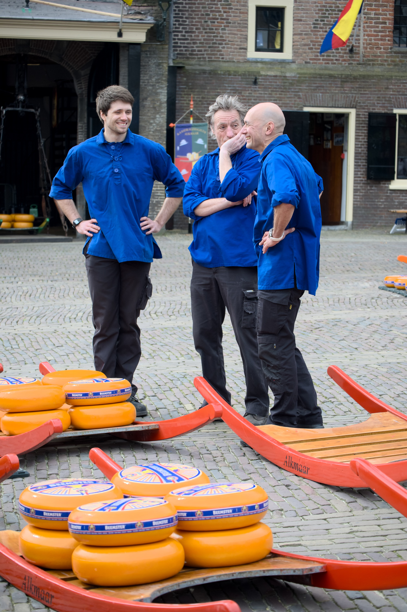

<!-- Headings -->

Looking back at these photos, I was apprently in my very experimental phase. Or at least that's what you should say to make it sound thought-out and consistent. At the time, I didn't know I was. All I cared about was taking interesting photos. And boy oh boy, are they.

This is a selection of photos taken in late March 2024 in the Netherlands, in various points throughout the country. I used mostly a medium format Flexaret VI TLR (square, 6x6 films), a Canon 7 with a couple of lenses, the most obvios one being the Voigtlander 15mm super wide (35mm films), a Fuji X-T20, an iPhone, and a DJI Mini 3 drone. In my defense, we were driving, so I never had to actually carry much at any given time.

The photos hare are probably not the objectively best of the entire bunch, but they are ones that seem the most interesting.
One of the more characteristic films I've used — one that's strongly contributed to this being and experimental phase — was Has 400T from [has.films](https://has65.film). It was an early lot, and I probably didn't always store it right, which contributed to light leaks and color shifts. Plus, it's not easy to scan. The other color film in 35mm was the original run of Harman Phoenix — the red halation gives it away.
On medium format, I had to shoot the Flexaret wide open, because Netherlands in March is not usually super sunny — who knew? That's one factor. The other is that the coating is pretty vintage, and does a fairly poor job of controlling falre and loss of contrast due to backlighting (or sidelighting, or, well, almost any lighting it seems). It can give sharp photos, or at least it used to, but a combination of my technique, my film choices, and the lighting conditions made for ~~a technically bad~~ an experimental result. Plus, slow films and slow lens mean long exposure times, and camera shake. So yeah, experimental phase for sure.

That said, our visit to the Keukenhof Gardens resulted in my significant other and myself being featured on German ZDF TV. We're stars now!
While we were shooting this session, a TV crew filming their segment on the opening of the gardens noticed us and filmed a couple of seconds for their intro. Still counts!

# Museums

One of the things the Netherlands is famous for (apart from the cheese, the bikes, and polders, and the windmills) is the art. We had a chance to look at both the classics, and the more modern collections. And the museums themselves are often quite a sight.

# Cheese!

And the Alkmaar cheese market

# Windmills and sundry architecture

This was on an office building. I actually find this sentence a bit scary...

# Tulips

<!-- Images -->

